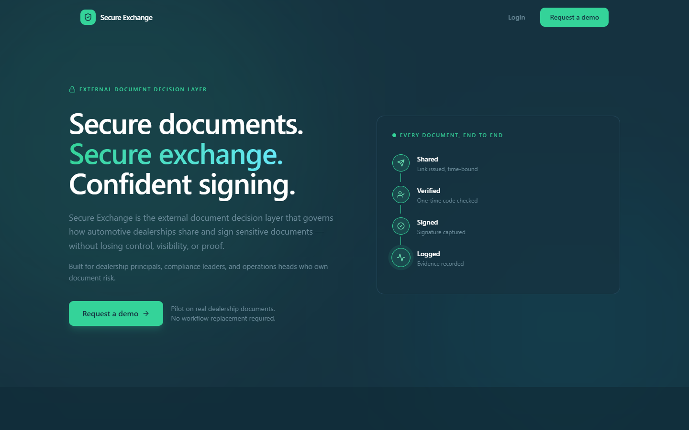
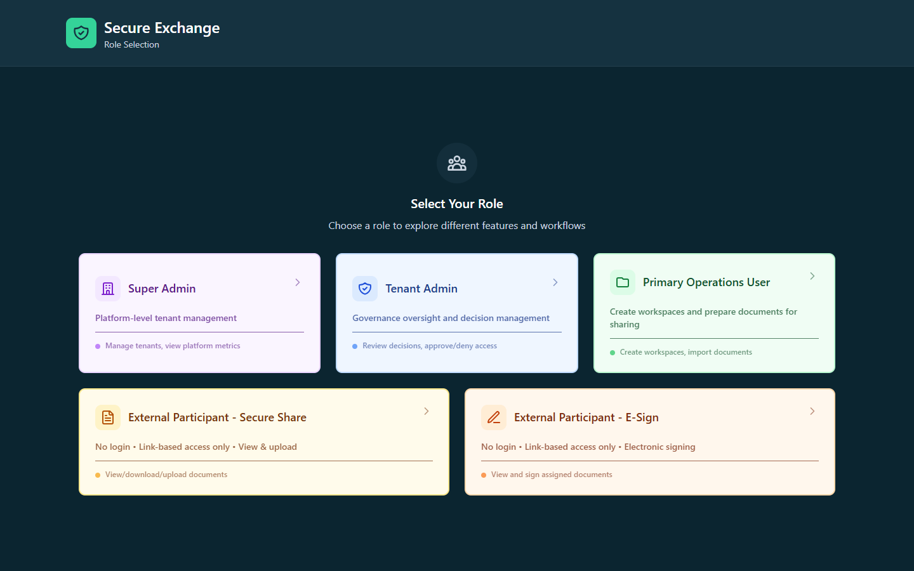
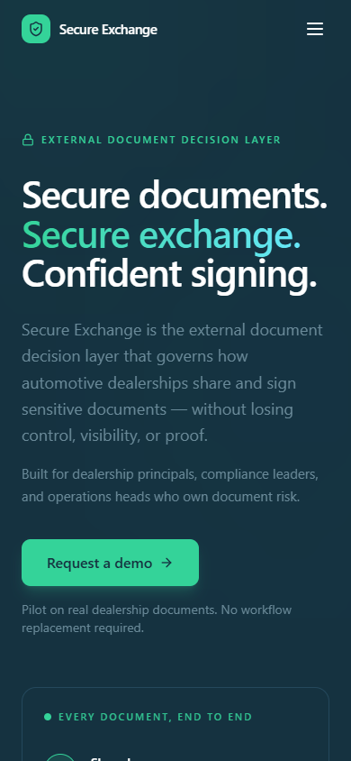
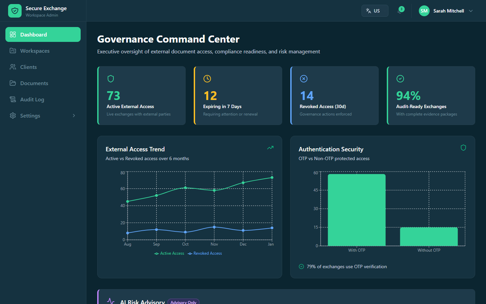
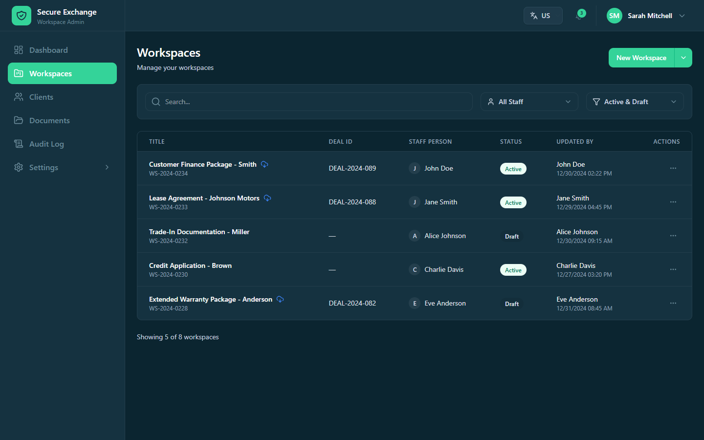
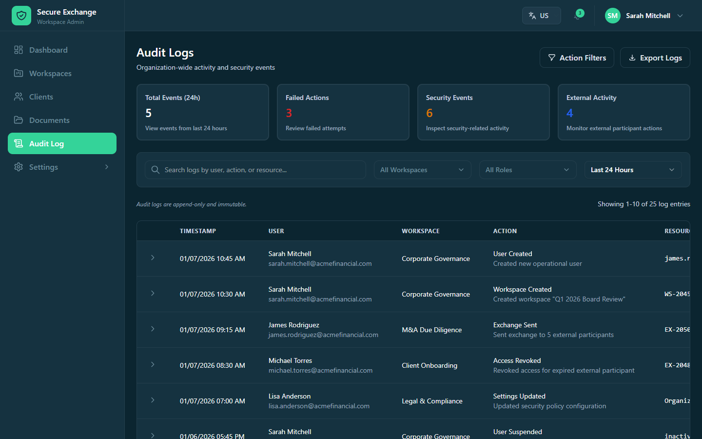
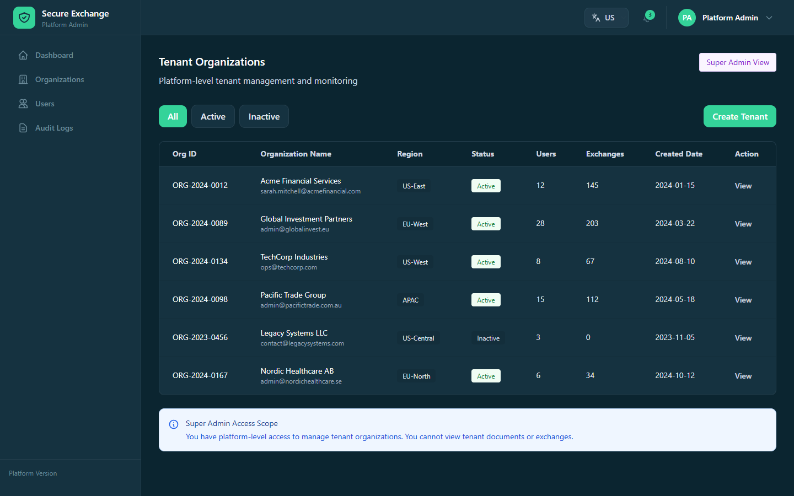
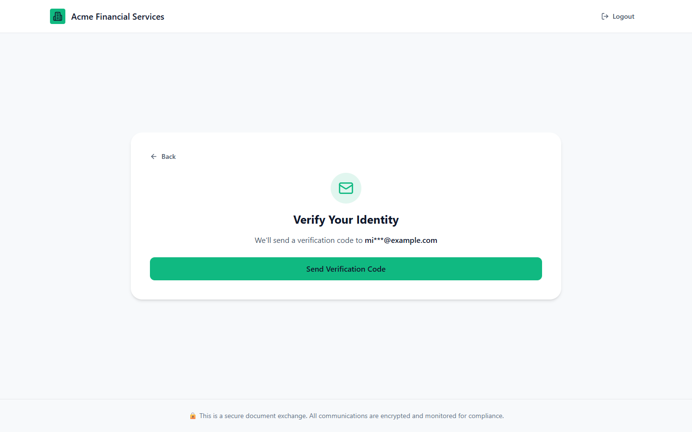
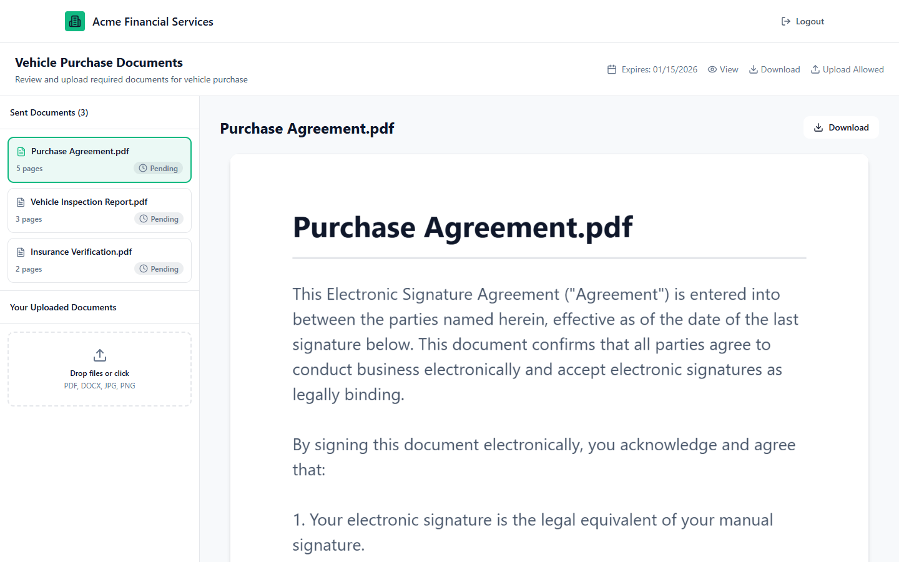
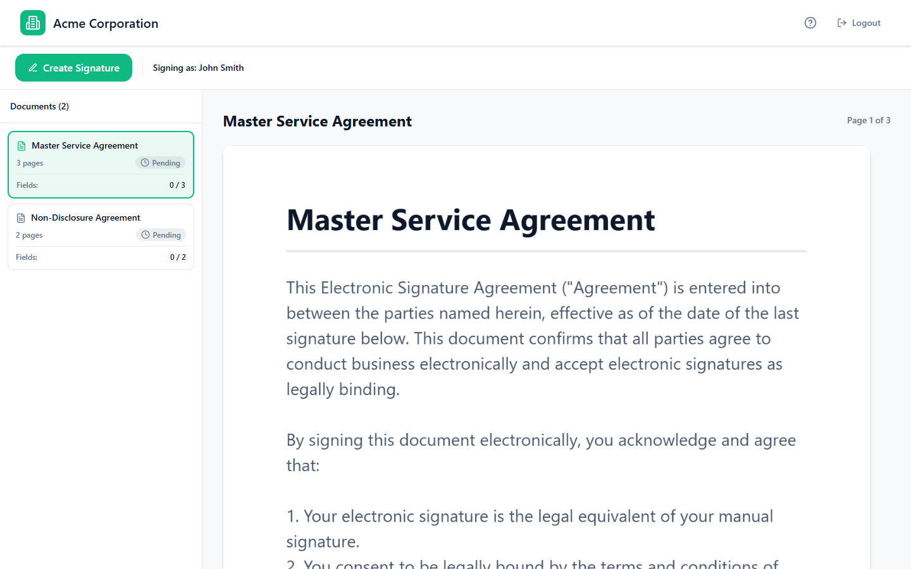

# Secure Exchange

A clickable prototype of a B2B platform for sharing and e-signing sensitive documents
with people outside your organization — built for dealership groups handling F&I
paperwork, where every document that leaves the building has to be traceable.

> **This is a demo, not a product.** All data is mocked in the browser. There is no
> backend, no real authentication, and nothing is persisted between page loads.



---

## The problem it demonstrates

A dealership sends a customer a credit application, a purchase agreement, and an
insurance form. Today that often happens over email — no expiry, no identity check,
no record of who opened what. If a regulator asks who saw a customer's SSN and when,
there is no answer.

Secure Exchange models the alternative: every document goes out on a time-bound link,
the recipient verifies with a one-time code, signatures are captured in-app, and every
step lands in an audit log.

Each document moves through four states, which is the spine of the whole app:

**Shared** → **Verified** → **Signed** → **Logged**

---

## Who uses it

The demo ships four roles. Pick one from the role switcher on launch.

| Role | Scope | What they do |
| --- | --- | --- |
| **Super Admin** | Whole platform | Provision organizations, manage platform users, read cross-tenant audit logs |
| **Tenant Admin** | One organization | Governance oversight, approve/deny exchanges, manage users, roles and integrations |
| **Primary Operations User** | Day-to-day desk | Create workspaces, prepare documents, send exchanges, chase signatures |
| **External Participant** | A single link | No account. Opens a link, verifies with an OTP, reviews, uploads or signs |

External participants never log in and never see internal navigation — see
[EXTERNAL_PARTICIPANT_MODEL.md](EXTERNAL_PARTICIPANT_MODEL.md) for the full access model.

---

## What's in the demo

- **Workspaces** — group the documents for one deal, with participants and status
- **Secure Share** — send documents on an expiring link with optional OTP and upload-back
- **E-Sign** — drag signature, initials and date fields onto a document, then send for signing
- **Signing ceremony** — the external-facing flow: welcome, OTP, review, sign, thank you
- **Decision review** — approve, deny, or approve-with-conditions before anything goes out
- **Audit logs** — a filterable trail at platform, tenant and operations level
- **Settings** — organization profile, users, roles and permissions, integrations
- **English and French** via the language switcher

---

## Screenshots

### Getting in

The landing page adapts from desktop down to phone. "Login" opens a role switcher —
the demo's way of letting you see the product from every angle without accounts.

<table>
<tr>
<td width="60%"></td>
<td width="40%"></td>
</tr>
<tr>
<td align="center"><em>Role switcher</em></td>
<td align="center"><em>Landing page at 390px</em></td>
</tr>
</table>

### Admin

**Tenant Admin — Governance Command Center.** Executive view of external access,
expiring links, revocations and audit readiness.



**Workspaces.** Every deal's documents, participants and status in one list.



**Audit logs.** Append-only, filterable by workspace, role and time window. Wide
tables scroll inside their card rather than stretching the page.



**Super Admin — Tenant Organizations.** The platform-level view across all tenants.



### External participants

External participants never log in. They open a link, prove who they are with a
one-time code, and only ever see the documents on that link.

**Identity verification.**



**Secure Share — review and upload.** The recipient reviews what was sent and uploads
anything requested back.



**E-Sign ceremony.** The signing flow, with per-document field progress on the left.



---

## Stack

| | |
| --- | --- |
| Framework | React 18 + TypeScript 5.7 |
| Build | Vite 6 |
| Styling | Tailwind CSS 4 (`@theme` tokens in `src/styles/theme.css`) |
| Components | shadcn/ui primitives over Radix, vendored in `src/app/components/ui/` |
| Motion | `motion` 12 — all animation respects `prefers-reduced-motion` |
| i18n | `react-i18next` with browser language detection |
| Toasts | `sonner` |
| Icons | `lucide-react` |

---

## Layout

```
src/
  main.tsx              entry point
  i18n.ts               i18next setup
  locales/              en.ts, fr.ts
  contexts/             theme + external-participant theme
  styles/               Tailwind entry and design tokens
  app/
    App.tsx             role switching and view routing (no router — state driven)
    types.ts            shared domain types
    utils/              status colors and other shared helpers
    components/
      landing/          landing page building blocks
      settings/         organization, users, roles, integrations
      external-v2/      Secure Share participant flow
      external-ceremony/  E-Sign participant flow
      ui/               shadcn/ui primitives
scripts/
  selfcheck.mjs         assertions that guard what a type checker can't — that
                        buttons change state rather than logging, that toasts are
                        mounted, that retired role names stay gone
```

Navigation is driven by React state in `App.tsx` rather than a router, so the whole
demo runs as a single page.

---

## Responsive behavior

The app targets phone, tablet, laptop and large-desktop widths.

- Below `md`, the sidebar collapses into a drawer behind the hamburger menu
- Data tables scroll horizontally inside their card instead of stretching the page
- The e-sign editor's document list and field tools become off-canvas panels below `lg`
- The signing ceremony's document list does the same
- Admin pages cap at `1600px` so content doesn't sprawl on large monitors

---

## Further reading

- [ROLE_PERMISSIONS.md](ROLE_PERMISSIONS.md) — the full RBAC matrix
- [SCREENS_SPECIFICATION.md](SCREENS_SPECIFICATION.md) — every screen and user flow
- [EXTERNAL_PARTICIPANT_MODEL.md](EXTERNAL_PARTICIPANT_MODEL.md) — link-based external access
- [TREE_STRUCTURE.md](TREE_STRUCTURE.md) — component hierarchy
- [ATTRIBUTIONS.md](ATTRIBUTIONS.md) — third-party licenses
